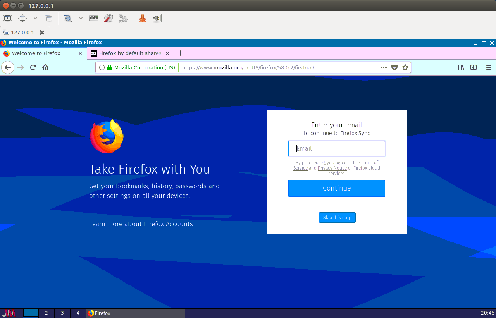
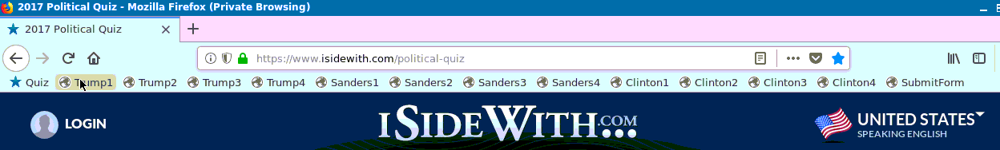
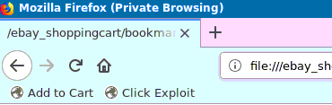

# Data Gathering Environment for Side-Channel Detection


Docker Container Setup
----------------------

```
docker-compose build
docker-compose up -d
```

Graphical Access
----------------

- Login to VNC server at `127.0.0.1:5900`
- VNC Password is `123456`




Gathering Data from iSideWith.com
---------------------------------

- Import the bookmarks stored in `/trump_clinton_sanders_bookmarks.html` into the Firefox browser within the container

- Add them to the *Bookmarks Toolbar* as show in image below


- Obtain shell access to the container
```
docker exec -it datagatheringenvironment_isolated_browser_1 bash
```

- From the container, run the data gathering script
```
./automate_istandwith_hillary_donald.sh RUNTIMES
```
replacing `RUNTIMES` with the number of times you would like to run the test.


Gathering Data from Google Search Auto-Complete
-----------------------------------------------

- Obtain shell access to the container
```
docker exec -it datagatheringenvironment_isolated_browser_1 bash
```

- From the container, run the data gathering script
```
./automate_google_search.sh
```


Gathering Data for eBay Shopping Cart Test
------------------------------------------

- Within the contained Firefox browser, add the following bookmarks to the *Bookmarks Toolbar*


- For the bookmark `Add to Cart` set its *location* to:
```
javascript:document.querySelector("#isCartBtn_btn").click()
```

- For the bookmark `Click Exploit` set its *location* to:
```
javascript:document.querySelector("#btnExploit").click()
```

- On the host machine run the following command within this directory:
```
./remote_run_full_test.sh datagatheringenvironment_isolated_browser_1
```


Cleanup
-------

- Remove the Docker container
```
docker-compose down
```
