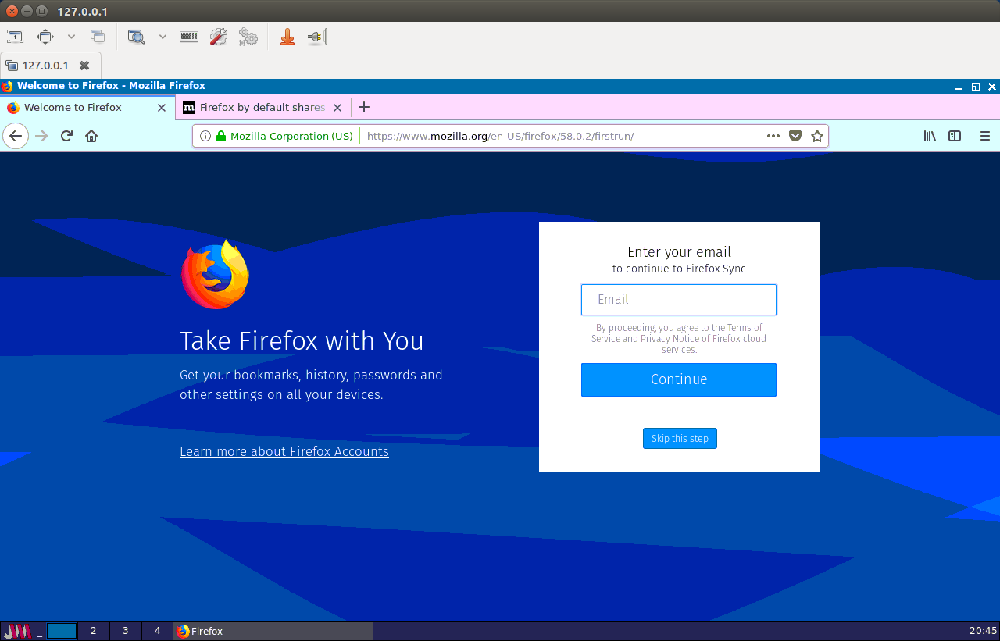

# Google Censorship Example

Docker Container Setup
----------------------

```
docker-compose build
docker-compose up -d
```


Firewall Setup
--------------

- Get IP address of Docker container
```
docker inspect examplegooglecensorship_isolated_browser_1 | grep IPAddress
```
- Run the following commands replacing `<CONTAINER_IP>` with the address from the previous step
```
sudo iptables -t raw -A PREROUTING -s <CONTAINER_IP> -j NFQUEUE --queue-num 0
sudo iptables -I DOCKER -d <CONTAINER_IP> -j NFQUEUE --queue-num 0
```

Running the Censorship script
-----------------------------

- To allow all traffic through
```
sudo python realtime_google_filter.py bypass
```

- To censor traffic
```
sudo python realtime_google_filter.py
```

Graphical Access
----------------

- Login to VNC server at `127.0.0.1:5900`
- VNC Password is `123456`




Cleanup
-------

- Remove the Docker container
```
docker-compose down
```

- Run the following commands replacing `<CONTAINER_IP>` with the address from the *Firewall Setup* step.
```
- sudo iptables -t raw -D PREROUTING -s <CONTAINER_IP> -j NFQUEUE --queue-num 0
- sudo iptables -D DOCKER -d <CONTAINER_IP> -j NFQUEUE --queue-num 0
```
